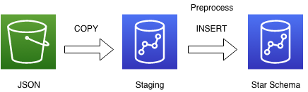
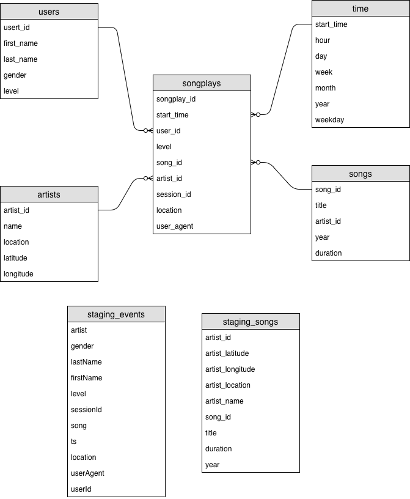

# Data Warehouse

This is a udacity's data engineer nano-degree project.

## About the project

In this project, we setup the ETL pipeline which move raw json data stored in S3 to cloud distributed database (Redshift).
In this process, the raw data moved from S3 to the staging table and then transform the data of the staging table to target tables which are optimized for business requirement. 

The pipeline contains the following processes:
1. Setup distributed database cluster in AWS.
2. Define database tables which include staging and target tables.
3. Load json data stored in S3 into staging tables.
4. Preprocess data in the staging tables to fit the target tables where the schema is optimized for business analysis.
5. Insert preprocessed data into target tables.




## Contents

`dwh.cfg`: definitions of parameters such as S3 url and cluster settings. Note that some parameters are passed by environment variables instead of the configuration file.

`etl.py`:  loads `song_data` and `log_data` data from S3 to staging tables, and transform staging data into target tables.

`sql_queries.py`: defines all sql queries used this project.

`README.md`: this document.

`setupcluster.py`: setup redshift cluster automatically by using aws sdk (`boto3`).

`create_tables.py`: drops and creates tables. You run this file to reset your tables before each time you run your ETL scripts.

`sql_queries.py`: contains all your sql queries, and is imported into the last three files above.

`README.md`: this document.

`requirements.txt`: dependencies are defined, which is created by `pip freeze` in the project workspace.

`test_count_record.py`: run queries that count records of each table.

`shutdowncluster.py`: remove 

## Dataset
The raw data for this project are not included in this repository. 
They are stored in S3. The urls are defined in `dwh.cfg`.

```
LOG_DATA='s3://udacity-dend/log-data'
LOG_JSONPATH='s3://udacity-dend/log_json_path.json'
SONG_DATA='s3://udacity-dend/song-data'
```

The `song-dataset` is a subset of the [Million Song Dataset](https://labrosa.ee.columbia.edu/millionsong/).
The `log-dataset` is generated by this [event simulator](https://github.com/Interana/eventsim) based on the songs.
The `log_json_path.json` is a definition file of log dataset. The [JSONPath](https://docs.aws.amazon.com/ja_jp/redshift/latest/dg/copy-usage_notes-copy-from-json.html)  specifies mappings from json's item to staging table columns.

The data are stored in the multiple files in the following layout.

```
$ tree ./data

data
├── log_data
│   └── 2018
│       └── 11
│           ├── 2018-11-01-events.json
...
│           └── 2018-11-30-events.json
└── song_data
    └── A
        ├── A
        │   ├── A
        │   │   ├── TRAAAAW128F429D538.json
...
        │   │   └── TRAAAVO128F93133D4.json
        │   ├── B
        │   │   ├── TRAABCL128F4286650.json
...
        │   │   └── TRAABYW128F4244559.json
        │   └── C
        │       ├── TRAACCG128F92E8A55.json
...
        │       └── TRAACZK128F4243829.json
        └── B
            ├── A
            │   ├── TRABACN128F425B784.json
...
            │   └── TRABAZH128F930419A.json
            ├── B
            │   ├── TRABBAM128F429D223.json
...
            │   └── TRABBZN12903CD9297.json
            └── C
                ├── TRABCAJ12903CDFCC2.json
...
                └── TRABCYE128F934CE1D.json
```

## Requirement

This project assumes that you have created IAM user that has `AmazonRedshiftFullAccess` and `AmazonS3ReadOnlyAccess`.
The dependencies of python packages are defined in `requirements.txt`. In the project's directory, the following command will install the required dependencies. 

```
pip3 install pip install -r requirements.txt
```

To avoid some sensitive information comes into the script directory, I defined environment variables.
To run the scripts correctly, you should define the following variable your system in advance.

```
DWH_AWS_KEY="AWS API KEY Access key ID of IAM user with full access of Redshift"
DWH_AWS_SECRET="Secret access key"
DWH_AWS_ROLE_ARN="Corresponding role's ARN"

export DWH_AWS_KEY
export DWH_AWS_SECRET
export DWH_AWS_ROLE_ARN
```

## Usage
Prepare AWS account and create IAM user. Set appropriate value in `dwh.cfg` and define environment variables.

Setup cluster by the following command.
You should confirm that redshift cluster appropriately setting up at your aws console.
You also setup cluster manually from aws console.
```
python setupcluster.py 
```

Create staging and target tables.
```
python create_tables.py
```

Run `etl.py` to import S3 data to tables. It takes about 1 hour.

```
python etl.py
```

You can check how many records are imported by using the following command
```
python test_count_record.py
```

Shutdown created the cluster. You also shutdown your cluster manually from aws console.
```
python shutdowncluster.py 
```

## About Table Schema

### Table Definition

In this project, the following tables are defined.

#### Fact Table

* songplays - records in log data associated with song plays i.e. records with page NextSong
  - songplay_id
  - start_time
  - user_id
  - level
  - song_id
  - artist_id
  - session_id
  - location
  - user_agent

#### Dimension Tables
* users - users in the app
  - user_id
  - first_name
  - last_name
  - gender
  - level

* songs - songs in the music database
  - song_id
  - title
  - artist_id
  - year
  - duration

* artists - artists in the music database
  - artist_id
  - name
  - location
  - lattitude
  - longitude

* time - timestamps of records in songplays broken down into specific units
  - start_time
  - hour
  - day
  - week
  - month
  - year
  - weekday

#### Staging Tables

* staging_events
  - artist
  - gender
  - lastName
  - firstName
  - level
  - sessionId
  - song
  - ts
  - location
  - userAgent
  - userId

* staging_songs
  - artist_id
  - artist_latitude
  - artist_longitude
  - artist_name
  - song_id
  - title
  - duration
  - year

### ER diagram

The table schema can be visualized by using Entity Relational Diagram. The following figure describes the table schema of the project.


